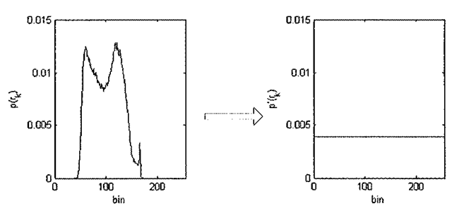
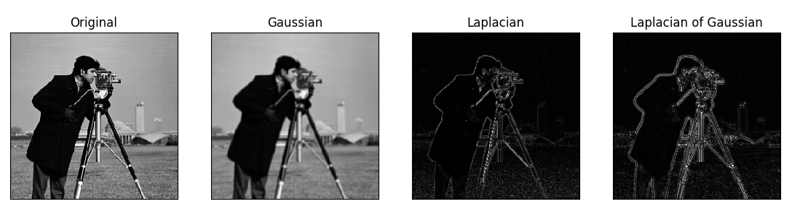

# Automotive Software Engineering

## Image/ video processing
- Everyone has access to a camera 
- Solutions out there: 
    - Cloud computing
    - Multimedia processors (Nvida Tegra)
    - FPGA
- It's cool

## System requeriments
- Python2.7 
- Python virtual environment
- OpenCV, numpy, matlibplot

```sh
$ pip install virtualenv
$ virtualenv aenv
$ source aenv/bin/activate
```

You should have something like: 
```sh
(aenv) $ 
```

## Basic Image processing
- Enhancement (histogram equalization) 
- Filtering
    - Gaussian
    - Laplacian
    - Laplacian of Gaussian

## Histogram equalization


```python
equ = cv2.equalizeHist(img)
```

## Filtering 
- Gaussian
$$
 f(x\mid \mu ,\sigma ^{2})={\frac {1}{\sqrt {2\pi \sigma ^{2}}}}e^{-{\frac {(x-\mu )^{2}}{2\sigma ^{2}}}}
$$

```python
gaussian = cv2.GaussianBlur(img,(5,5),0)
```

- Laplacian
$$
 \Delta f=\nabla ^{2}f=\nabla \cdot \nabla f
$$

```python
laplacian = cv2.Laplacian(img,cv2.CV_64F)
```




## Task 1:
- Streaming a grayscale real-time video. The original video and enhanced version should be streamed. The enhanced version must be proccessed in two steps:
    - Step 1 - Laplacian of Gaussian: to enhance the edges ( $original - LoG$ )
    - Step 2 - Equalization: to enhance the overall image quality

- **TIPS**: 
    - Note that the output of the edge enhancement is not between 0 and 255, you should normalize the values
    - You may use `gray = cv2.cvtColor(frame, cv2.COLOR_BGR2GRAY)`
    - Google: how to use the RPI camera with Python and OpenCV

## Convolution
- Fundamental operation 
- Direct relation to Fourier Transform
- Highly used


 
