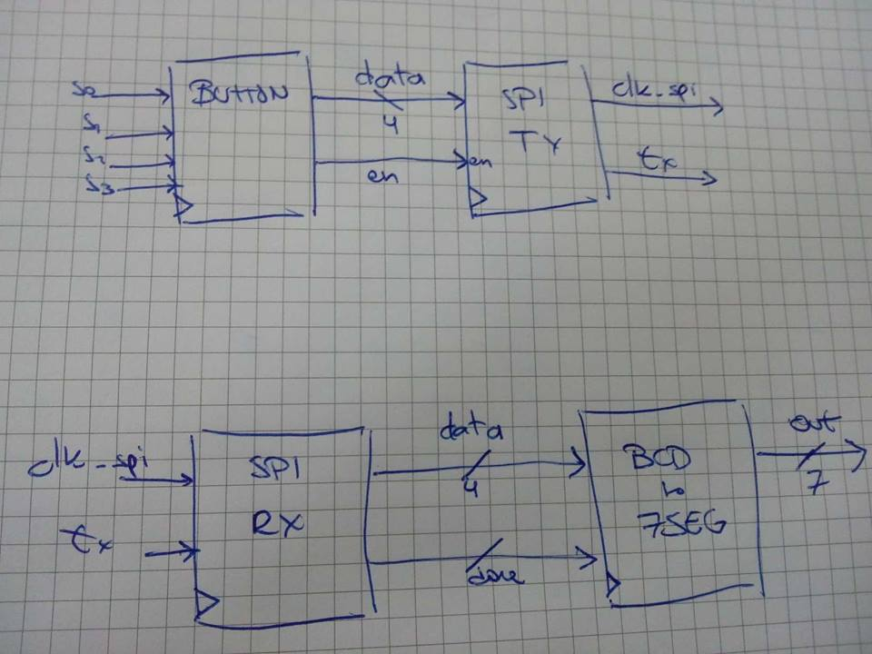

# Title: Serial communication

The goal is to communicate two FPGAs using a serial communication, in this case is based on SPI.

## FPGA ports:
- 135: external clock with a jumper based freq selector (1, 5, 10, 100, 1K, 10K, 100K, 1M)hz
- 106, 110-115: 7-segment display
- 17, 19, 22, 30: Debounced buttons
- 51-92: Port 2 
- 137-180: Brevia Port

## Idea:
The goal is to push in the FPGA master  any combination of debounced buttons, for example _0101_, and the 7-segment display of the FPGA slave should decimal number of the combination, in this case is 5. 
The communication protocol is based on SPI. Thus, this will be our setting: 

- Clk from FPGA master will be used as SPI clk
- Transmit a 4-bit data packet 




In blocks:

BUTTONS --> SPI --> CONVERT BIN TO 7SEG --> DISPLAY

All blocks will have it's own clock and reset as well

## Buttons
Since they are debounced buttons, there is no need for a debouncing circuit. 
The goal of this block is to:
- Generate the data vector (4 bits) to transmit
- Enable the SPI-TX block

```vhdl
--  Pseudocode
--  States: IDLE, EN_TX (enable transmission)
port(
     s: in std_logic_vector (3 downto 0);
    en: out std_logic;
    data: out std_logic_vector (3 downto 0)
);
    
IDLE: 
    if (press_buttons):
        next_state <= EN_TX;

EN_TX:
    data <= s;
    en <= 1
    next_state <= IDLE

```

## SPI
The communication will be only in one direction, so we will need only two lines.
One for the SPI clock and the other for transmission from FPGA master to FPGA slave.
- TX: 
```vhdl
-- Pseudocode

port( 
    data : in std_logic_vector (3 downto 0);
    en: in std_logic;
    clk_spi: out std_logic;
    tx: out std_logic
);
```

- RX: 
```vhdl
-- Pseudocode 

port(
    clk_spi: in std_logic;
    rx: in std_logic;
    data: out std_logic_vector (3 downto 0);
    done: out std_logic
);
```

## Converter 
The implementation will be done by **with ... select ... when**

```vhdl
-- Pseudocode
-- States: IDLE, SHOW
port(
    data: in std_logic_vector (3 downto 0);
    done: in std_logic;
    out: out std_logic_vector (6 downto 0) -- 7segment
);

IDLE:
    if (done):
        next_state <= SHOW
    else 
        out <= (others => '0') -- implies BCD to 7SEGMENT
    
SHOW:
    out <= data -- this implies BCD to 7SEGMENT conversion
    next_state <= IDLE
```


