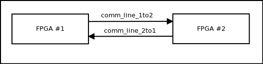
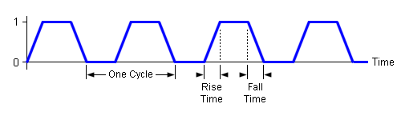
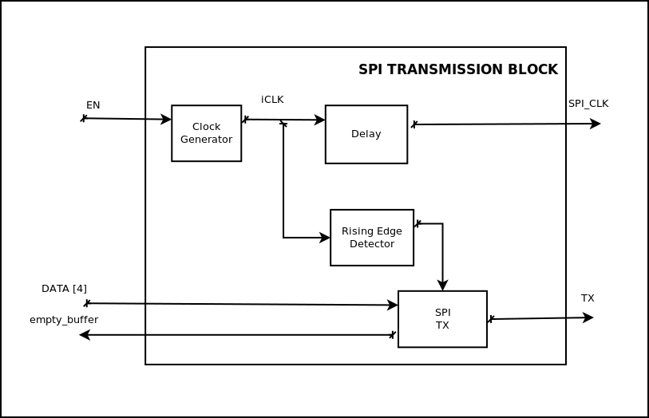
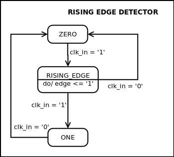
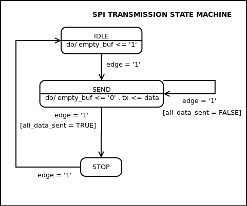
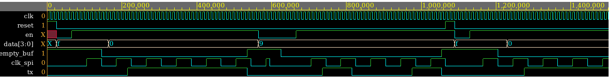
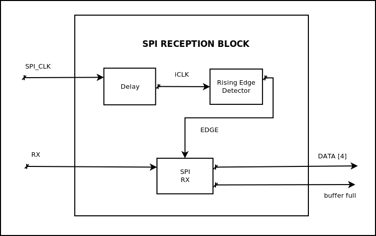
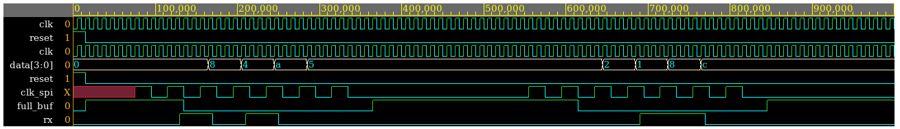

<!---
\newpage
--> 


The goal is to send a telegram from one FPGA to another using serial communication. Both FPGAs should be able to send a telegram. 
In our case,  our communication is a SPI-based one. Our design uses two SPI-based lines of communications in order to make possible the bidirectional communication. 

# SPI-based Communication protocol
The standard Serial Peripheral Interface (SPI) which uses the MASTER-SLAVE principle and it uses 4 lines of data transmission (spi_clk, MISO, MOSI, SS). 
On the other hand, our designed protocol also uses the Master-Slave principle but it only uses 2 lines of data transmission since we only have one slave, and the communication only goes from the master to the slave. 
In other words, we use a generated clock (SPI_clk) and the MOSI (Master Output, Slave Input)  


Both lines of data transmission are going to be considered as **one line of communication**. As shown in Figure 2, our design will have two lines of communication. One will goes from the FPGA number 1 to FPGA number 2 (comm_line_1to2) and the other goes in the other direction (comm_line_2to1).




## Details of our SPI-based protocol 
Our protocol uses five main blocks: "Rising edge detector", "clock generator",a "delay", "SPI transmission component" and "SPI reception component".

* **Clock generator**: used to generated the SPI clock
* **Rising edge detector**: to detect the rising edges of the SPI clock. We need it because the SPI clock is not ideal (instant change between '0' and '1'); in other words, it takes some time to change from '0' to '1' and vice versa, and the transition is a ramp. See picture below.
* **Delay**: since the SPI clock is not ideal we need a delay to synchronize (avoid the transition) any signal with that clock
* **SPI transmission component**: is in charge of sending the data through TX port
* **SPI reception component**: is in charge of receiving the data through RX port





# SPI Transmission block

The SPI Transmission is located in the side of the FPGA master. The internal block diagram is presented in Figure 4. 
Our transmission block have 2 inputs: Enable SPI clock signal `EN` and data to transmit `DATA`; and 3 outputs: A buffer `empty_buffer` that works as feedback to other blocks that want to send data through our SPI channel, the SPI generated clock `SPI_clk`  used to synchronize the communication between master and slave, and the transmission pin `TX`. 

 
As it can be observed, our design includes 4 blocks. A clock generator that runs 20 times slower than the FPGA internal clock and this clock will be used as the **SPI clock** (`SPI_clk`); a delay or synchronizer that is used to avoid reading data during ramps in the `SPI_clk`;  rising edge detector, used to detect rising edges of our `SPI_clk`; and the proper SPI transmission component which is in charge of sending the data.   





## Clock Generator
We used a state machine with only two states (ONE, ZERO) and a counter. In each state we reset the counter to zero and it starts counting up to some fixed maximum count, in our case is maximun count fixed to ten. 
Which means that our generated clock will run twenty times slower.
The entity of this block is as follows:


```vhdl
entity clk_generator is
    port (  clk: in std_logic; 
            reset: in std_logic; 
            en: in std_logic;
            clk_out: out std_logic
         );
end entity clk_generator;
```

The output of a testbench can be observed in Figure X..... As you can see the output clock runs 20 times slower that the internal clock. 

## Delay or synchronizer
This block is basically two cascaded flip flops type D. A testbench result is presented in Figure X 

```vhdl
entity  delay_sync is
    port (  clk: in std_logic;
            reset: in std_logic;
            d: in std_logic;
            q: out std_logic
         );
end entity delay_sync;
```


## Rising Edge Detector
This component has the following entity:

```vhdl
entity rising_edge_detector is
    port (  clk: in std_logic;
            reset: in std_logic; 
            clk_in: in std_logic;
            edge: out std_logic
         ); 
end entity rising_edge_detector;
``` 

This block is based in a state machine with three states (ONE, ZERO, RISING_EDGE). The state machine is presented in Figure X. The initial state is ZERO and once the clock changes to `1`, the detector goes to RISING_EDGE state. In the RISING_EDGE state `edge` is set to `1`, which means that a rising edge has been detected; afterwards, whether the clock signal is `0` or `1` the next state is either `ZERO` or `ONE`. If the next state is `ONE`, the component will be in that state until the clock signal changes to `0`.  

{height=40%}

## SPI TX component
The entity definition of this component is as follows: 

```vhdl
entity spi_tx is
    port (  clk: in std_logic;
            reset: in std_logic;
            edge: in std_logic;  
            data: in std_logic_vector (7 downto 0);
            empty_buf: out std_logic;
            tx: out std_logic
         );
end entity spi_tx; 
```

The behaviour is showned in Figure X. The SPI TX component will be in state IDLE until an `edge` is detected, of course while the component is in IDLE it means that it's waiting for data to send which means that the transmission buffer is empty ( `empty_buf <= '1'`). 
 When an edge is detected the component goes to SEND state. It's in this state where the serial transmission takes place. In every detected edge a bit is sent through TX port, also the flag that states the transmission is taking place is sent to `0` (`empty_buf <= '0'`). The least significant bit is sent first.
Once all the data is sent (`all_data_sent = TRUE`), the component goes to STOP state. In this state the component makes sure that the last sent bit had enough time to be received without problems. Finally, in the next `edge` the component goes to IDLE state.   

{height=40%}


## Putting all together: SPI Transmission Block
As it was mentioned in Section 2, our SPI transmission block is made of four blocks (Figure 4). The entity definition is as follows:

```vhdl
entity spi_block_tx is
    port (  clk: in std_logic; 
            reset: in std_logic; 
            data: in std_logic_vector (7 downto 0);
            en: in std_logic; 
            empty_buf: out std_logic; 
            clk_spi: out std_logic;
            tx: out std_logic
        );
end entity spi_block_tx; 
```

The inputs of this block are mainly an enable `en`, data to be transmitted `data` and have three outputs. A flag `empty_buf` that tells the other blocks whether this block is ready to send data (`empty_buf = '1'`)  or not (`empty_buf = '0'`), the SPI clock `clk_spi` that is generated only when the block is enable, and the transmission port `tx` from where the transmitted data can be read.

A pseudocode of the main functionality of the SPI transmission block is presented

```vhdl
-- SPI transmission block pseudocode  
while (EN = '1') 
    generate(SPI_clk)
    while ( isSendingData )
        empty_buffer <= '0'
        if ( rising_edge_detector (SPI_clk) )
            TX <= send_BIT
    
    empty_buffer <= '1'
```

A testbench result can be observed in Figure X. 

 

# SPI Reception block 
- SPI Rx (internal block)

```vhdl
-- Pseudocode 
while ( rising_edge_detected )
    full_buf <= '0'
    data <= fill_with(rx_BIT)

full_buf <= '1'
inMemory(data) 
```


All the blocks have a clock and reset signal. 

- SPI TX Block: 
    - **NOTE**: Maybe we should add one more delay before transmit the data. 


- SPI TX Block testbench:



- SPI RX Block: 
    - **NOTE**: Not tested



- SPI RX Block testbench
 



# Other blocks
## FPGA ports:
- 135: external clock with a jumper based freq selector (1, 5, 10, 100, 1K, 10K, 100K, 1M)hz
- 106, 110-115: 7-segment display
- 17, 19, 22, 30: Debounced buttons
- 51-92: Port 2 
- 137-180: Brevia Port

## Idea:
The goal is to push in the FPGA master  any combination of debounced buttons, for example _0101_, and the 7-segment display of the FPGA slave should decimal number of the combination, in this case is 5. 
The communication protocol is based on SPI. Thus, this will be our setting: 

- Clk from FPGA master will be used as SPI clk
- Transmit a 4-bit data packet 


In blocks:

BUTTONS --> SPI --> CONVERT BIN TO 7SEG --> DISPLAY

All blocks will have it's own clock and reset as well

## Buttons
Since they are debounced buttons, there is no need for a debouncing circuit. 
The goal of this block is to:
- Generate the data vector (8 bits) to transmit
- Enable the SPI-TX block

```vhdl
--  Pseudocode
--  STATES: IDLE, EN_TX (enable transmission)
port(
     s: in std_logic_vector (7 downto 0);
    en: out std_logic;
    data: out std_logic_vector (7 downto 0)
);
    
IDLE: 
    if (press_buttons):
        next_state <= EN_TX;

EN_TX:
    data <= s;
    en <= 1
    next_state <= IDLE

```

## Converter 
The implementation will be done by **with ... select ... when**

```vhdl
-- Pseudocode
-- STATES: IDLE, SHOW
port(
    data: in std_logic_vector (7 downto 0);
    done: in std_logic;
    out: out std_logic_vector (6 downto 0) -- 7segment
);

IDLE:
    if (done):
        next_state <= SHOW
    else 
        out <= (others => '0') -- implies BCD to 7SEGMENT
    
SHOW:
    out <= data -- this implies BCD to 7SEGMENT conversion
    next_state <= IDLE
```


