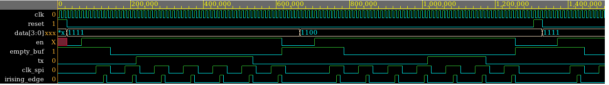

The goal is to send a telegram from one FPGA to another using serial communication. Both FPGAs should be able to send a telegram. 
In our case,  our communication is a SPI-based one. Our design uses two SPI-based lines of communications in order to make possible the bidirectional communication. 

# SPI-based Communication protocol
The standard Serial Peripheral Interface (SPI) which uses the MASTER-SLAVE principle and it uses 4 lines of data transmission (spi_clk, MISO, MOSI, SS). 
On the other hand, our designed protocol also uses the Master-Slave principle but it only uses 2 lines of data transmission since we only have one slave, and the communication only goes from the master to the slave. 
In other words, we use a generated clock (SPI_clk) and the MOSI (Master Output, Slave Input)  


Both lines of data transmission are going to be considered as **one line of communication**. As shown in Figure 2, our design will have two lines of communication. One will goes from the FPGA number 1 to FPGA number 2 (comm_line_1to2) and the other goes in the other direction (comm_line_2to1).


## Details of our SPI-based protocol 
Our protocol uses three main blocks: "Rising edge detector", "clock generator"  and a  "delay". 

* **Clock generator**: used to generated the SPI clock
* **Rising edge detector**: to detect the rising edges of the SPI clock. We need it because the SPI clock is not ideal (instant change between '0' and '1'); in other words, it takes some time to change from '0' to '1' and vice versa, and the transition is a ramp. See picture below.
* **Delay**: since the SPI clock is not ideal we need a delay to synchronize (avoid the transition) any signal with that clock


## SPI Transmission 

```vhdl
-- Pseudocode 
if (en = '1') 
    generate(SPI_clk)
    while ( isSendingData )
        empty_buff <= '0'
        if ( rising_edge (SPI_clk) )
            tx <= send_BIT
    
    empty_buff <= '1'
```

- SPI Rx (internal block)

```vhdl
-- Pseudocode 
while ( rising_edge_detected )
    full_buf <= '0'
    data <= fill_with(rx_BIT)

full_buf <= '1'
inMemory(data) 
```


All the blocks have a clock and reset signal. 

- SPI TX Block: 
    - **NOTE**: Maybe we should add one more delay before transmit the data. 


- SPI TX Block testbench:



- SPI RX Block: 
    - **NOTE**: Not tested


- SPI RX Block testbench
 


#
## FPGA ports:
- 135: external clock with a jumper based freq selector (1, 5, 10, 100, 1K, 10K, 100K, 1M)hz
- 106, 110-115: 7-segment display
- 17, 19, 22, 30: Debounced buttons
- 51-92: Port 2 
- 137-180: Brevia Port

## Idea:
The goal is to push in the FPGA master  any combination of debounced buttons, for example _0101_, and the 7-segment display of the FPGA slave should decimal number of the combination, in this case is 5. 
The communication protocol is based on SPI. Thus, this will be our setting: 

- Clk from FPGA master will be used as SPI clk
- Transmit a 4-bit data packet 


In blocks:

BUTTONS --> SPI --> CONVERT BIN TO 7SEG --> DISPLAY

All blocks will have it's own clock and reset as well

## Buttons
Since they are debounced buttons, there is no need for a debouncing circuit. 
The goal of this block is to:
- Generate the data vector (8 bits) to transmit
- Enable the SPI-TX block

```vhdl
--  Pseudocode
--  STATES: IDLE, EN_TX (enable transmission)
port(
     s: in std_logic_vector (7 downto 0);
    en: out std_logic;
    data: out std_logic_vector (7 downto 0)
);
    
IDLE: 
    if (press_buttons):
        next_state <= EN_TX;

EN_TX:
    data <= s;
    en <= 1
    next_state <= IDLE

```

## SPI
The communication will be only in one direction, so we will need only two lines.
One for the SPI clock and the other for transmission from FPGA master to FPGA slave.

We implemented a "Rising edge detector", "clock generator"  and a  "delay". 
- Clock generator: used to generated the SPI clock
- Rising edge detector: to detect the rising edges of the SPI clock. We need it because the SPI clock is not ideal (instant change between '0' and '1'); in other words, it takes sometime to change from '0' to '1' and viceversa, and the transtions is a ramp. See picture below.
- Delay: since the SPI clock is not ideal we need a delay to synchronize (avoid the transtion) any signal with that clock


- SPI Tx (internal block)

```vhdl
-- Pseudocode 
if (en = '1') 
    generate(SPI_clk)
    while ( isSendingData )
        empty_buff <= '0'
        if ( rising_edge (SPI_clk) )
            tx <= send_BIT
    
    empty_buff <= '1'
```

- SPI Rx (internal block)

```vhdl
-- Pseudocode 
while ( rising_edge_detected )
    full_buf <= '0'
    data <= fill_with(rx_BIT)

full_buf <= '1'
inMemory(data) 
```


All the blocks have a clock and reset signal. 

- SPI TX Block: 
    - **NOTE**: Maybe we should add one more delay before transmit the data. 


- SPI TX Block testbench:


- SPI RX Block: 
    - **NOTE**: Not tested


- SPI RX Block testbench
 


## Converter 
The implementation will be done by **with ... select ... when**

```vhdl
-- Pseudocode
-- STATES: IDLE, SHOW
port(
    data: in std_logic_vector (7 downto 0);
    done: in std_logic;
    out: out std_logic_vector (6 downto 0) -- 7segment
);

IDLE:
    if (done):
        next_state <= SHOW
    else 
        out <= (others => '0') -- implies BCD to 7SEGMENT
    
SHOW:
    out <= data -- this implies BCD to 7SEGMENT conversion
    next_state <= IDLE
```


