<!---
\newpage
--> 


# SPI-based Communication protocol
The standard Serial Peripheral Interface (SPI) which uses the MASTER-SLAVE principle and it uses 4 lines of data transmission (spi_clk, MISO, MOSI, SS). 
On the other hand, our designed protocol also uses the Master-Slave principle but it only uses 2 lines of data transmission since we only have one slave, and the communication only goes from the master to the slave. 
In other words, we use a generated clock (SPI_clk) and the MOSI (Master Output, Slave Input)  


## Details of our SPI-based protocol 
Our protocol uses five main blocks: "Rising edge detector", "clock generator",a "delay", "SPI transmission component" and "SPI reception component".

* **Clock generator**: used to generated the SPI clock
* **Rising edge detector**: to detect the rising edges of the SPI clock. We need it because the SPI clock is not ideal (instant change between '0' and '1'); in other words, it takes some time to change from '0' to '1' and vice versa, and the transition is a ramp. See picture below.
* **Delay**: since the SPI clock is not ideal we need a delay to synchronize (avoid the transition) any signal with that clock
* **SPI transmission component**: is in charge of sending the data through TX port
* **SPI reception component**: is in charge of receiving the data through RX port


{height=15%}


# Communication related components
All the components in our design have a internal clock signal and an asynchronous reset signal.

## Clock Generator
We used a state machine with only two states (ONE, ZERO) and a counter. In each state we reset the counter to zero and it starts counting up to some fixed maximum count, in our case is maximun count fixed to ten. 
Which means that our generated clock will run twenty times slower.
The entity of this block is as follows:


```vhdl
entity clk_generator is
    port (  clk: in std_logic; 
            reset: in std_logic; 
            en: in std_logic;
            clk_out: out std_logic
         );
end entity clk_generator;
```

The output of a testbench can be observed in Figure 3. As you can see the output clock runs 20 times slower that the internal clock. 

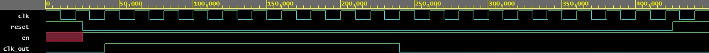

## Delay or synchronizer
This block is basically a flip flops type D. A testbench result is presented in Figure 4 

```vhdl
entity  delay_sync is
    port (  clk: in std_logic;
            reset: in std_logic;
            d: in std_logic;
            q: out std_logic
         );
end entity delay_sync;
```

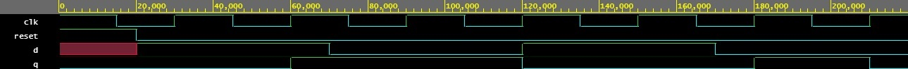

## Rising Edge Detector
This component has the following entity:

{height=20%}

```vhdl
entity rising_edge_detector is
    port (  clk: in std_logic;
            reset: in std_logic; 
            clk_in: in std_logic;
            edge: out std_logic
         ); 
end entity rising_edge_detector;
``` 

This block is based in a state machine with three states (ONE, ZERO, RISING_EDGE). The state machine is presented in Figure 5. The initial state is ZERO and once the clock changes to `1`, the detector goes to RISING_EDGE state. In the RISING_EDGE state `edge` is set to `1`, which means that a rising edge has been detected; afterwards, whether the clock signal is `0` or `1` the next state is either `ZERO` or `ONE`. If the next state is `ONE`, the component will be in that state until the clock signal changes to `0`.  

A testbench is presented in Figure 6.

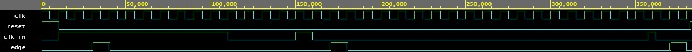

## SPI TX component
The entity definition of this component is as follows: 

```vhdl
entity spi_tx is
    port (  clk: in std_logic;
            reset: in std_logic;
            edge: in std_logic;  
            data: in std_logic_vector (7 downto 0);
            empty_buf: out std_logic;
            tx: out std_logic
         );
end entity spi_tx; 
```
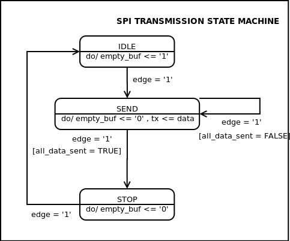{height=20%}

The behaviour is showned in Figure 7. The SPI TX component will be in state IDLE until an `edge` is detected, of course while the component is in IDLE it means that it's waiting for data to send which means that the transmission buffer is empty ( `empty_buf <= '1'`). 
 When an edge is detected the component goes to SEND state. It's in this state where the serial transmission takes place. In every detected edge a bit is sent through TX port, also the flag that states the transmission is taking place is sent to `0` (`empty_buf <= '0'`). The least significant bit is sent first.
Once all the data is sent (`all_data_sent = TRUE`), the component goes to STOP state. In this state the component makes sure that the last sent bit had enough time to be received without problems. Finally, in the next `edge` the component goes to IDLE state. The results of the testbench can be observed in Figure 8.


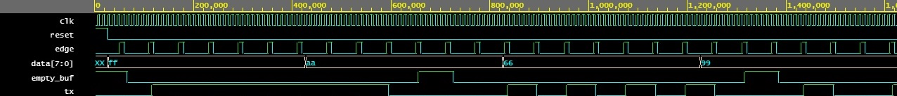

## SPI RX component
The entity definition of this component is as follows: 

```vhdl
entity spi_rx is
    port (  clk: in std_logic;
            reset: in std_logic;
            edge: in std_logic;  
            rx: in std_logic;
            data: out std_logic_vector (7 downto 0);
            full_buf: out std_logic
         );
end entity spi_rx; 
```
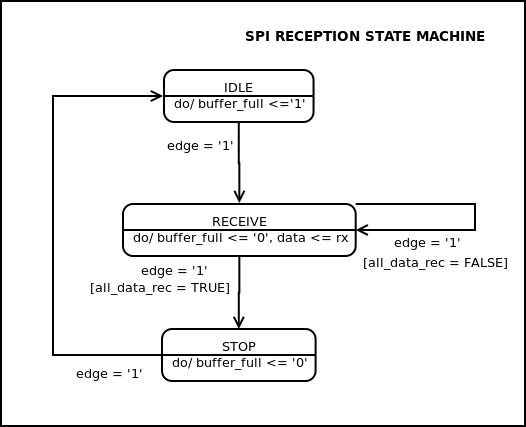{height=20%}

The behaviour is showned in Figure 9. The SPI RX component will be in state IDLE until an `edge` is detected. Similar to transmission block, the component while in IDLE reception buffer is set to 1 ( `buffer_full <= '1'`). 
 When an edge is detected the component goes to SEND state starting the data frame reception. In every detected edge a bit is received through RX port, also the flag that states the reception is taking place is set to `0` (`buffer_full <= '0'`). The least significant bit is received first. The reception is done by using a shifting register. 
Once all the data is received (`all_data_rec = TRUE`), the component goes to STOP state. In this state the component makes sure that all the bits have been received and the new data is ready to be read. Finally, in the next `edge` the component goes to IDLE state again.   

The results of the testbench can be observed in Figure 10.

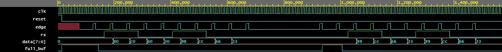

# SPI Transmission block
The SPI Transmission is located in the side of the FPGA master. The internal block diagram is presented in Figure 11. 
Our transmission block have 2 inputs: Enable SPI clock signal `EN` and data to transmit `DATA`; and 3 outputs: A buffer `empty_buffer` that works as feedback to other blocks that want to send data through our SPI channel, the SPI generated clock `SPI_clk`  used to synchronize the communication between master and slave, and the transmission pin `TX`. 
 
As it can be observed, our design includes 4 blocks. A clock generator that runs 20 times slower than the FPGA internal clock and this clock will be used as the **SPI clock** (`SPI_clk`); a delay or synchronizer that is used to avoid reading data during ramps in the `SPI_clk`;  rising edge detector, used to detect rising edges of our `SPI_clk`; and the proper SPI transmission component which is in charge of sending the data.   


The entity definition is as follows:

```vhdl
entity spi_block_tx is
    port (  clk: in std_logic; 
            reset: in std_logic; 
            data: in std_logic_vector (7 downto 0);
            en: in std_logic; 
            empty_buf: out std_logic; 
            clk_spi: out std_logic;
            tx: out std_logic
        );
end entity spi_block_tx; 
```

The inputs of this block are mainly an enable `en`, data to be transmitted `data` and have three outputs. A flag `empty_buf` that tells the other blocks whether this block is ready to send data (`empty_buf = '1'`)  or not (`empty_buf = '0'`), the SPI clock `clk_spi` that is generated only when the block is enable, and the transmission port `tx` from where the transmitted data can be read.

A pseudocode of the main functionality of the SPI transmission block is presented

```vhdl
-- SPI transmission block pseudocode  
while (EN = '1') 
    generate(SPI_clk)
    while ( isSendingData )
        empty_buffer <= '0'
        if ( rising_edge_detector (SPI_clk) )
            TX <= send_BIT
    
    empty_buffer <= '1'
```

A testbench result can be observed in Figure 12. 

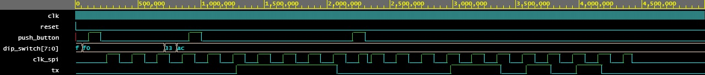

# SPI Reception block 

The SPI Reception is located in the side of the FPGA slave. The internal block diagram is presented in Figure 13. 
This block have 2 inputs: the SPI generated clock `SPI_clk` form master, and the reception frame `RX`; also have two outputs: the received data `data` and a buffer `buffer_full` that tell other blocks that there is data ready to be read. 

The entity definition is as follows:

```vhdl
entity spi_block_rx is
    port (  clk: in std_logic; 
            reset: in std_logic; 
            clk_spi: in std_logic;
            rx: in std_logic;
            data: out std_logic_vector (7 downto 0);
            full_buf: out std_logic
        );
end entity spi_block_rx; 
```

 
As it can be observed, our design includes three blocks. A delay or synchronizer that is used to avoid reading data during ramps in the `SPI_clk`;  rising edge detector, used to detect rising edges of our `SPI_clk`; and the SPI reception component which is in charge of recieving the data frame.   


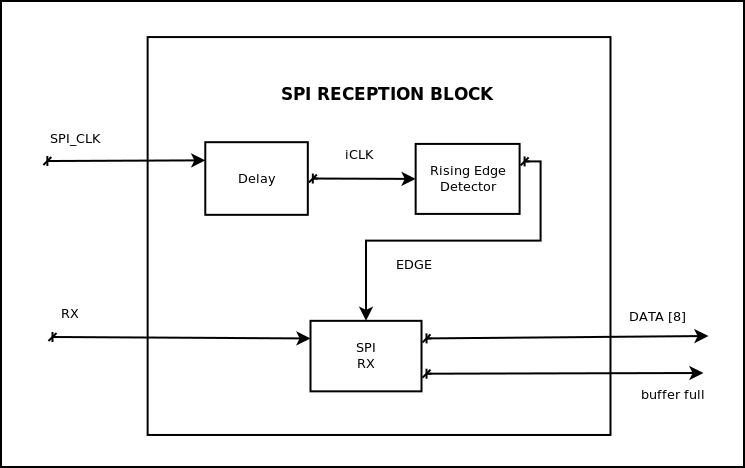{height=30%}

A pseudocode of the main functionality of the SPI recieving block is as follows:

```vhdl
-- SPI reception block Pseudocode 
while ( rising_edge_detected )
    buffer_full <= '0'
    data <= fill_with(rx_BIT)

buffer_full <= '1'
inMemory(data) 
```

The testbench results of the SPI reception block can be observed in Figure  14.

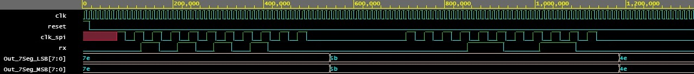{height=30%}


# Test Case
The goal is to send a telegram from one FPGA to another using serial communication. Both FPGAs should be able to send a telegram. The telegram is 8-bit long and this information should be displayed in two 7-segment screen located in the other FPGA. 
In our case,  our communication is a SPI-based one. Our design uses two SPI-based lines of communications in order to make possible the bidirectional communication. 
 

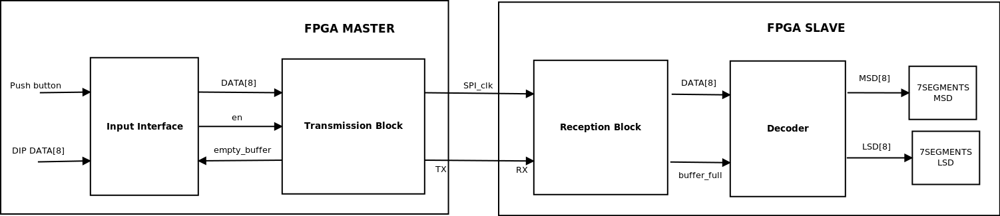

In Figure 14 can be observed that the inputs are given by a push button and a dip switch. **Input interface** is in charge of manage the telegram, when the button is pressed the telegram given by the dip switch is sent through the transmission port (`TX`) if the transmission buffer is empty (`empty_buffer == 1`).

 And after reception the **decoder block** will use the data collected by **reception block** to decode the telegram in two data arrays (LSD - Least significant digit and MSD - Most significant digit) that will be displayed in two 7-Segment displays.


We already discussed how the **reception block** and **transmission block** work. Now we will focus on the **Input interface** and **decoder**. 
The input interface  block will send the data once the user release the push button if the transmission buffer is free, if the transmission buffer is not free no data is sent. 
The decoder block will read the data from reception block once reception buffer is full. Then we use a look up table to get the LSD and MSD in 7-Segment format. 


The lines of data transmission shown in Figure 1 are going to be considered as **one line of communication**. In other words, our  test case will have two lines of communication as shown in Figure 15.   One will goes from the FPGA number 1 to FPGA number 2 (comm_line_1to2) and the other goes in the other direction (comm_line_2to1).


